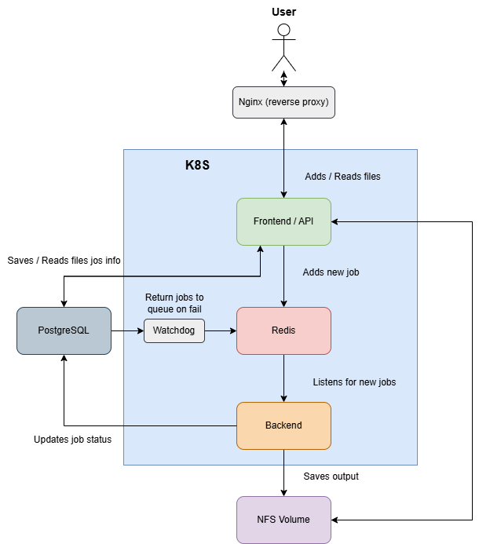

# File Compressor

A horizontally scalable, self‑healing service for compressing files at scale. This repository is structured as a monorepo containing all components—from front‑end to back‑end, autoscaling controllers, cleanup jobs, GitHub workflows, and observability manifests.

----------
## Requirements
To deploy and run this project, the following infrastructure must be available:

-   **Kubernetes Cluster** – Required to run all workloads.
    
-  **Nginx (Reverse Proxy)** – A reverse proxy running outside the cluster (e.g. on the host machine) that forwards traffic from port 80 to the Kubernetes master node to port 30080.
    
-   **PostgreSQL Database** – External DB instance accessible from within the cluster.
    
-   **NFS Storage** – Shared persistent volume with two mount paths: one for raw files (`PENDING`), one for compressed results (`DONE`).
    
-   **GitHub Actions Runner** – A self-hosted runner with Docker and `kubectl` installed is required to execute CI/CD pipelines defined in `.github/workflows/`.
- 
- **Docker Registry** – A private or local Docker registry used to push and pull built images for deployment.
    

Ensure all required credentials are available in repository based on `config/.env.template`.

----------

## Architecture



-   **User** – Interacts with the service via browser.
    
-   **Nginx (reverse proxy)** – Handles HTTP and routes traffic to the front-end/API.
    
-   **Frontend / API** – Next.js application with a FastAPI layer for handling file uploads/downloads and job creation.
    
-   **Redis** – Lightweight Redis queue (via RPUSH/LBPOP) storing job IDs to be processed; actual job data is stored in PostgreSQL.
    
-   **Backend** – Listens for Redis jobs, compresses files, updates PostgreSQL, and saves results to NFS.
    
-   **PostgreSQL** – Stores file metadata, job status, heartbeat.
    
-   **Watchdog** – Queries PostgreSQL for jobs where `status = 'in_progress'` and the last heartbeat is older than 10 seconds; such jobs are considered stalled and are re-queued in Redis for retry processing (3 retries max).
    
-   **NFS Volume** – Shared storage for uncompressed (pending) and compressed (finished) files.
    

----------

## Components

### Front-end

-   **Path:**  `front-end/`
    
-   **Image:**  `front-end`
    
-   **Description:** Next.js 14 UI that allows users to upload and download files. Displays real-time progress updates via WebSocket.
    

### Service API

-   **Path:** Co-located with front-end
    
-   **Image:**  `service-api`
    
-   **Description:** Minimal FastAPI wrapper that exposes the `/api/upload` endpoint and relays job status via WebSocket.
    

### Back-end

-   **Path:**  `backend/`
    
-   **Image:**  `backend`
    
-   **Description:** FastAPI workers that perform the actual file compression. They read job IDs from Redis, load job metadata from PostgreSQL, and output compressed files to NFS.
    

### Watchdog

-   **Path:**  `watchdog/`
    
-   **Image:**  `watchdog`
    
-   **Description:** Periodically checks PostgreSQL for jobs with `status='in_progress'` and a heartbeat older than 10 seconds. Such jobs are assumed stalled and are re-added to Redis for reprocessing.
    

### Backend-scaler

-   **Path:**  `crontab/`
    
-   **Image:** N/A
    
-   **Description:** A Bash script registered via `crontab` runs every 15 seconds, checks the number of nodes in the Kubernetes cluster, and adjusts the number of backend replicas accordingly using `kubectl scale`. It is not based on Kubernetes HPA or metrics.
    

### Cleanup CronJob

-   **Path:**  `cronjobs/cleanup-cronjob.yml`
    
-   **Image:**  `cleanup`
    
-   **Description:** Nightly job that deletes files older than a specified age from NFS.
    

### Redis

-   **Path:**  `redis/`
    
-   **Image:**  `redis:latest`
    
-   **Description:** Used as a Redis Queue (RQ) via RPUSH/LBPOP to hold job IDs.
    

### PostgreSQL

-   **Path:** External
    
-   **Image:**  N/A
    
-   **Description:** Stores job metadata, user accounts, authentication tokens, and heartbeats. Credentials are defined in `.env.template`.
    

### NFS Share

-   **Path:** External mount (`PENDING`, `DONE`)
    
-   **Image:** N/A
    
-   **Description:** Shared volume for uploading raw files and storing the compressed outputs. Used by both front-end and back-end.
    

### Observability Stack

-   **Path:**  `observability/`
    
-   **Image:**  `prom/prometheus`, `grafana/grafana`
    
-   **Description:** Prometheus scrapes metrics via ServiceMonitor. Grafana visualizes them via predefined dashboards.

----------

## Data Flow

1.  **Upload**: Browser → `POST /api/upload` (multipart/form-data).
    
2.  **Queue**: Front‑end streams file to NFS pending; job is queued in Redis (RQ).
    
3.  **Compress**: Back‑end dequeues, compresses file, writes output to NFS finished, updates PostgreSQL.
    
4.  **Download**: Front‑end generates URL; browser downloads from NFS share.
    
5.  **Cleanup**: CronJob deletes old files.


----------

## Specyfikacja i funkcje

**Funkcje formalne**

-   Kompresja plików graficznych, audio i wideo z wykorzystaniem FFmpeg i innych narzędzi.
-   Kolejkowanie zadań w Redisie i trwałe przechowywanie metadanych w PostgreSQL.
-   Śledzenie postępu i stanu zadań poprzez API (`/api/status`) oraz WebSocket.
-   Eksport metryk Prometheusa z front‑endu i backendu (`/api/metrics`).
-   Mechanizm watchdog do ponawiania zadań w przypadku zacięć.
-   Automatyczne skalowanie liczby workerów skryptem `backend-scaler.sh`.

**Funkcje nieformalne**

-   Rozszerzalna struktura monorepo ułatwiająca wdrażanie wszystkich komponentów.
-   Przykładowe dashboardy Grafany w `observability/`.
-   Formularz wysyłania plików generowany dynamicznie na podstawie `public/compression-options.json`.
-   Nightly cleanup usuwający przeterminowane pliki z udziału NFS.
-   Prosty proces CI/CD w GitHub Actions wraz z manifestami Kubernetes.


----------

## Deployment

Each component has a dedicated GitHub Actions workflow under `.github/workflows/`:

-   **deploy-frontend.yml**
    
-   **deploy-backend.yml**
    
-   **deploy-redis.yml**
    
-   **deploy-nfs.yml**
    
-   **deploy-observability.yml**
    
-   **deploy-watchdog.yml**
    
-   **deploy-cronjobs.yml**

----------

## Metrics & Monitoring

-   **Front‑end** 
- 
-   **Back‑end** 
    
-   **Watchdog**: `file_queue_length`, `backend_desired_replicas` (feeds HPA).
    

----------

## Environment Variables

Copy `config/.env.template` → `.env` and fill secrets (`$` prefixes expected from K8s Secrets).

```
# Example
PGHOST="192.168.1.190"
PGPORT="5432"
PGDATABASE="compressiondb"
PG_BACKEND_USER="appuser"
PG_BACKEND_PASSWORD="${DATABASE_PASS}"
```

## Front-End API Endpoints

### **POST** `/api/upload` 

Upload a file for compression. The file is queued for processing and tracked by UUID.

#### Example cURL

```bash
curl -X POST http://localhost:3000/api/upload \
  -F "file=@example.jpg" \
  -F "compressionType=jpegoptim" \
  -F "compressionLevel=5"
```

#### Example Response

```json
{
  "uuid": "c123abc4-def5-6789-ghij-klmno0123456",
  "message": "File has been added to the queue",
  "FileName": "example.jpg"
}
```

### **GET** `/api/status` 

Checks the status of a compression job.

#### Example

```
/api/status?uuid=c123abc4-def5-6789-ghij-klmno0123456
```

#### Example Response

```json
{
  "status": "finished",
  "fileName": "example.jpg",
  "downloadUrl": "/api/download?uuid=c123abc4-def5-6789-ghij-klmno0123456&name=example.jpg",
  "queuePosition": "-"
}
```

### **GET** `/api/download` 

Checks the status of a compression job.

#### Example

```
/api/download?uuid=c123abc4-def5-6789-ghij-klmno0123456&name=example.jpg
```

#### Response

Responds with a binary stream and appropriate Content-Disposition headers for downloading.

### **GET** `/api/metrics` 

Exposes Prometheus-compatible metrics. Requires HTTP Basic Authentication.

#### Authentication
- Uses HTTP Basic Auth.
- Credentials are provided via environment variables:
  - `METRICS_API_AUTH_USER`
  - `METRICS_API_AUTH_PASS`

#### Example cURL

```bash
curl -u yourUsername:yourPassword http://localhost:3000/api/metrics
```

#### Example Response

```bash
# HELP http_requests_total Total number of HTTP requests
# TYPE http_requests_total counter
http_requests_total{route="/api/upload",method="POST",status="200"} 3
...
```
Metrics are returned in Prometheus format and can be scraped periodically.

## Front-End Dynamic Form Schema

Form fields are dynamically generated based on the file type schema

#### Example

```json
{
  "jpg": {
    "options": [
      {
        "label": "Typ kompresji",
        "name": "compressionType",
        "type": "select",
        "values": ["jpegoptim", "mozjpeg", "guetzli"],
        "default": "jpegoptim",
        "required": true
      },
      {
        "label": "Poziom kompresji",
        "name": "compressionLevel",
        "type": "range",
        "min": 1,
        "max": 9,
        "default": 5
      }
    ]
  }
}    
```  